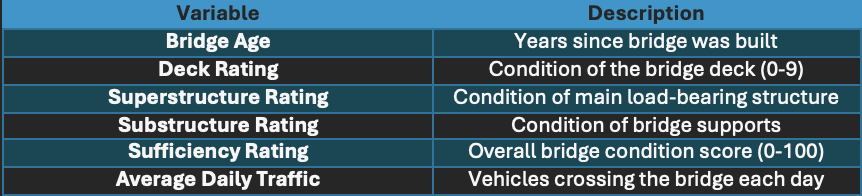
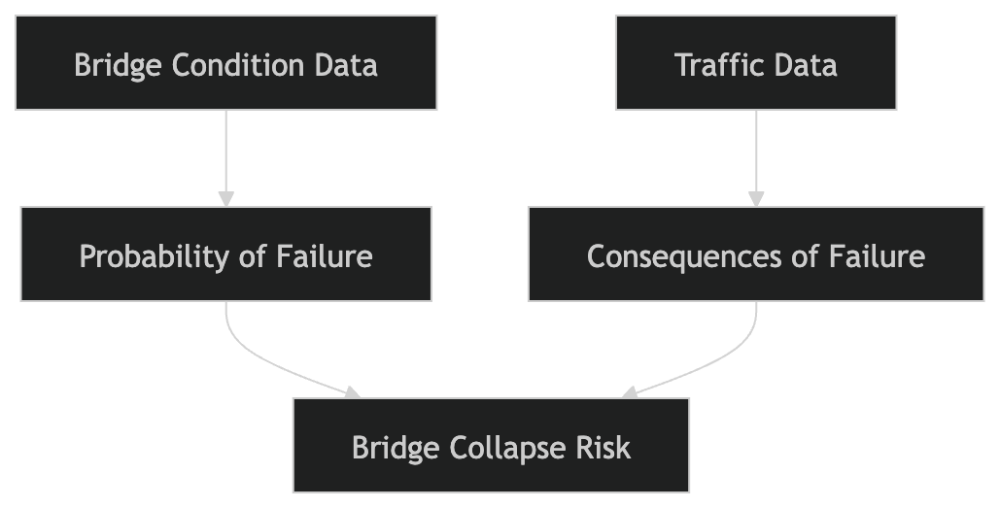

## Data Characteristics {.unnumbered}

The bridge condition data was collected from the National Bridge Inventory dataset provided by the Federal Highway Administration [@fhwa_nbi]. This dataset has information about brdige age, the structural condition, and also the overall bridge ratings.

The bridges condition is measured by three things, deck, superstructure, and substructure ratings. These ratings are on a scale from 0 to 9. Higher numbers mean the bridge is in better condition. The dataset also include a sufficiency rating. This ranges from 0 to 100 and gives the bridge an overall score.

Information about repairs and bridge management was also taken from the Nebraska Department of Transportation bridge reports [@ndot_bridge]. Traffic data was taken from Federal highway Administration, which includes estimates of how many vehicles use a brdige each day [@fhwa_stats].

Inclusion Criteria: The only bridges that were included are the ones located in the Omaha metropolitan area with complete structural condition ratings. Any bridges missing any ratings were not included.

::: callout-note

Tables should be generated using R/python and should be included in markdown via code, so that if your data updates your table updates too.

Same thing goes for your descriptive statistics -- you should use the inline code functionality in quarto to include averages and quantiles and such.

:::

Some descriptive statistics:

- The average bridge age is around 45 years.
- Most bridges have sufficiency ratings between 50 and 80.
- Around 12% of bridges have a sufficiency rating below 50, meaning it is in poor condition.
- Daily traffic ranges from a few thousand to 40,000 vehicles depending on the bridge.

## Primary Analysis: Probability of Failure {.unnumbered}

The probability of bridge failure was estimated by using the structural condition ratings matched with the bridge age. Bridges with lower ratings or lower sufficiency scores are high risk.

Older Bridges tend to have lower sufficiency scores. This suggests gradual deterioration over time. Most bridges however, are still in good condition. Some do have lower scores that could lead to a higher risk of problems in their structure.

## Secondary Analysis: Consequences of Failure {.unnumbered}

Traffic volume and planned maintenance were examined to estimate the potential consequences of a bridge collapse. Bridges that have a higher volume of cars each day would cause a lot more disruption if they failed.

Some bridges already have repairs planned or in the planning according to NDOT reports. This could help reduce near-term risk. Brdiges that carry high daily traffic and also have low sufficiency scores are the highest overall risk.

## Calculation of Bridge Risk {.unnumbered}

Overall bridge risk combines the probability of failure and the consequences of failure:

Risk = Probability of Failure × Consequence of Failure

::: callout-note

All figures must be generated reproducibly and included using quarto chunks, not figure inclusion. Do not number your figures individually - use figure labels and @fig-label to reference the figure in the text -- quarto will automatically add a number to the figure.

:::

### Key findings/Conclusion {.unnumbered}

Some key findings that were found was that most bridges are in fair to good condition. Only about 12% are actually in poor condition and need monitoring or repair. Next key finding is older bridges tend to have lower sufficiency ratings due to gradual deterioration. Also bridges with high traffic volumes would cause the biggest disruptions if they were to collapse. In conclusion, widespread bridge failure is unlikely, but targeted monitoring and maintence of lowe-rated brdiges is recommened over the nect five years to help reduce over risk of bridge failure.

::: callout-note

lots of spelling in this paragraph (and throughout).

Consider highlighting the conclusion in a box or something that will make it easy for a manager to find. Bullets are also useful.

:::
