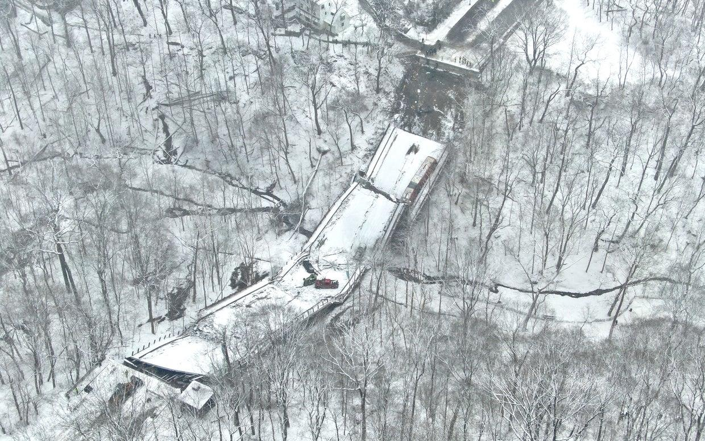

```{r}
#| echo: false
library(dplyr)

omaha_raw <- read.csv("omaha_sample.csv")

omaha_bridges_clean <- omaha_raw |>
  mutate(
    bridge_age = 2026 - year_built,
    lowest_rating = as.numeric(lowest_rating),
    daily_traffic = as.numeric(daily_traffic),
    poor_condition = lowest_rating <= 4
  )
```

# Why This Matters

:::: {.columns}

::: {.column width="45%"}
- Bridge failures have happened in the U.S.
- Can cause serious safety issues
- Can disrupt major traffic routes
:::

::: {.column width="55%"}
{width=100%}
:::

::::

# What I’ll Cover

- Data used
- How risk was calculated
- Key findings
- Recommendations

# Data Used

- National Bridge Inventory (main data set)
- Includes bridge condition and age
- Traffic data used to measure impact
- Nebraska Department of Transportation(NDOT) was used for additional context

- 511 bridges analyzed in Omaha

# Key Variables

- Bridge age (calculated from year built)
- Condition ratings (scale from 0–9)
- Lowest condition rating used for analysis
- Traffic (vehicles per day)

- Poor condition defined as rating ≤ 4

# Methods

- Filtered data to Omaha (Douglas County)
- Removed bridges with missing data
- Calculated bridge age
- Identified bridges in poor condition

**Risk = Probability × Consequence**

- Condition ratings → probability of failure
- Traffic → impact if failure occurs

# Example of Cleaned Data

```{r}
#| echo: false

library(knitr)

kable(head(omaha_bridges_clean, 5))
```

# Data Characteristics

- 511 bridges total
- Average age ~45 years
- Only 16 bridges in poor condition (~3%)

Most bridges are still in fair to good condition

# Bridge Condition Distribution

```{r}
#| echo: false
#| fig-cap: "Distribution of bridge condition ratings in Omaha."

hist(omaha_bridges_clean$lowest_rating,
     main = "Bridge Condition Ratings",
     xlab = "Condition Rating (0–9)",
     ylab = "Number of Bridges")
```

# Probability of Failure

- Lower condition rating = higher risk
- Older bridges tend to have lower ratings
- Shows deterioration over time
- Most bridges are still in acceptable condition

# Consequences of Failure

- Traffic varies across bridges
- Some carry over 100,000 vehicles/day

**High traffic = bigger impact**

# Highest Risk Bridges

- Low condition rating (≤ 4)
- High traffic volume

→ Typically major routes (I-80, etc.)

# Key Findings

- Most bridges are in good condition
- Only 16 / 511 (~3%) are poor
- Older bridges show more wear
- High traffic = biggest impact

# Bridge Condition Summary

```{r}
#| echo: false
#| fig-cap: "Number of bridges in poor vs acceptable condition"

barplot(table(omaha_bridges_clean$poor_condition),
        names.arg = c("Not Poor", "Poor"),
        ylab = "Number of Bridges")
```

# Recommendations

- Monitor lower rated bridges more closely
- Prioritize repairs
- Continue inspections
- Focus on high traffic bridges

# Final Takeaway

Bridge collapse risk is low

BUT

Targeted maintenance is needed

# Thank You

Questions?